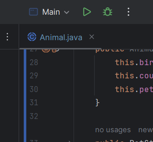

Jianchao MA
Projet PetStore EPSI CDA1 3ème Année
Lien du repo: https://github.com/Chao-Ma5566/petstore

# consignes d’éxécution
- Après cloner le projet, il faut lancer `mvn clean install` pour installer les dépendances.
- Il faut créer une base de donnée MariaDB avec le nom pet_store.
- Il faut changer url, user, password à le votre dans le dossier "src/main/resources/META-INF/persistence.xml"
- Après vous pouvez lancer le `main` avec le bouton vert.
- 